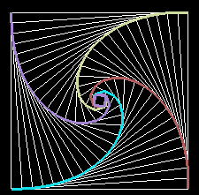

# Pursuit Curve Problem

This snippet of code visualizes the [Pursuit Curves](https://en.wikipedia.org/wiki/Pursuit_curve) between different moving objects, either with an image or an animation.
Simulation method has been used instead of mathematical formulation, using the pyglet library for rendering the images.

## Getting Started

Clone this repository on your local disk by executing the line below. 
Be aware you will download other small projects as well

git clone https://github.com/kokomero/miscelanea/

### Prerequisites

Install numpy and pyglet packages, these are available in the Python pip repository

### Execution

python object_pursuit_curve.py

The result of the execution should be a windows like the following one, in case we execute the fixed image:

The simulation can be ended by pressing ESC key or closing the window.

### Deployment

Just copy the files in a local directory, make sure the required libraries are installed and execute the script following above instructions.

## TODOs
* Implement antialiasing
* Define the configuration of the problem, including moving objects and their relationship in a configuration JSON file
* Move line width and colors to the configuration file. Each moving object could have lines linking pursuers and leaders in different colors
* Define scenarios in 3D space, and be able to rotate the image in 3D
* Be able to define parametric velocity vector for a leader so that we can implement circular movements

## References
* Wikipedia: [Pursuit Curves, in English](https://en.wikipedia.org/wiki/Pursuit_curve)
* Wikipedia: [Pursuit Curves, in French](https://fr.wikipedia.org/wiki/Courbe_du_chien)
* Universidad Complutense de Madrid: [Page on Pursuit Curves, in Spanish](http://www.mat.ucm.es/cosasmdg/cdsmdg/modelizaciones/proyectos/proyecto2/index.htm)
* Wolfram Research: [entry for Pursuit Curves, in English](http://mathworld.wolfram.com/PursuitCurve.html)

## Contributing

Feel free to contribute to this piece of code

## Authors
* **Victor Montiel** - *Initial work* - [Personal website](http://www.victormontielargaiz.net)

## License
No licence for this project

## Acknowledgments
* pyglet library

